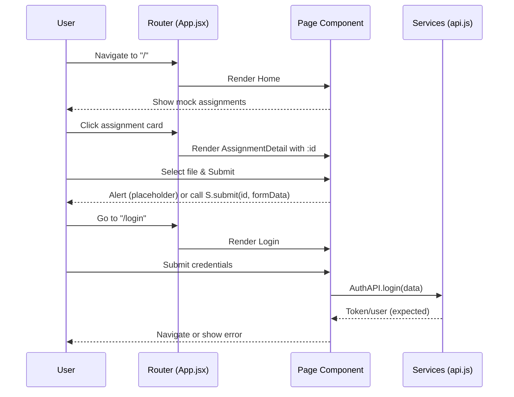

# Assignments Portal – Project Flow & Architecture

## 1) Overview
- **Purpose**: A lightweight front-end (Vite + React + React Router) for browsing assignments, basic auth screens, and simple submission flow.
- **Entry point**: `index.html` injects `src/main.jsx`, which mounts the React app at `#root`.
- **Routing**: `src/App.jsx` defines client-side routes using `react-router-dom@6`.
- **API Layer**: `src/services/api.js` wraps Axios with a base URL configured via `VITE_API_BASE_URL`.
- **Build Tool**: Vite for dev server, bundling, and preview.

## 2) Tech Stack
- **Framework**: React 18 (`react`, `react-dom`).
- **Router**: `react-router-dom` v6.
- **HTTP**: `axios` with an instance.
- **Bundler/Dev**: `vite` and `@vitejs/plugin-react`.
- **Styling**: Single CSS file at `src/styles.css`.

## 3) Directory Structure
```
frontend/
├─ index.html
├─ package.json
├─ vite.config.js
├─ src/
│  ├─ main.jsx
│  ├─ App.jsx
│  ├─ styles.css
│  ├─ components/
│  │  ├─ Navbar.jsx
│  │  ├─ Footer.jsx
│  │  └─ AssignmentCard.jsx
│  ├─ pages/
│  │  ├─ Home.jsx
│  │  ├─ Login.jsx
│  │  ├─ Register.jsx
│  │  ├─ StudentDashboard.jsx
│  │  ├─ TeacherDashboard.jsx
│  │  ├─ AssignmentDetail.jsx
│  │  └─ Contact.jsx
│  └─ services/
│     └─ api.js
└─ PROJECT_FLOW.md (this file)
```

## 4) Application Lifecycle
```mermaid
flowchart LR
    A[index.html] --> B[/#root/]
    B --> C(src/main.jsx)
    C --> D[createRoot + BrowserRouter]
    D --> E[src/App.jsx]
    E -->|<Routes/>| F[Route Components]
    F --> G[Components & Pages]
    G --> H[API Layer (axios)]
```

- `index.html` contains `<div id="root"></div>` and `<script type="module" src="/src/main.jsx"></script>`.
- `src/main.jsx`
  - Creates a root via `createRoot(document.getElementById('root'))`.
  - Wraps `App` with `BrowserRouter` and `React.StrictMode`.
- `src/App.jsx`
  - Renders `Navbar`, a main container with route definitions, and `Footer`.
  - Each route renders a page component.

## 5) Routing Flow (`src/App.jsx`)
- **Routes**:
  - `/` → `Home`
  - `/login` → `Login`
  - `/register` → `Register`
  - `/student` → `StudentDashboard`
  - `/teacher` → `TeacherDashboard`
  - `/assignments/:id` → `AssignmentDetail`
  - `/contact` → `Contact`
- **Navigation**:
  - `src/components/Navbar.jsx` uses `Link`/`NavLink`.
  - Active link styling via `.nav a.active` in `src/styles.css`.

## 6) Components & Pages
- **`Navbar.jsx`**: Top navigation with links to all main routes.
- **`Footer.jsx`**: Simple footer with current year.
- **`AssignmentCard.jsx`**: Displays assignment preview; links to detail route via `/assignments/:id`.
- **`Home.jsx`**: Lists mock assignments using `AssignmentCard`.
- **`Login.jsx`**: Minimal form (`email`, `password`) with local state. Submits via `alert` (placeholder).
- **`Register.jsx`**: Minimal form (`name`, `email`, `password`, `role`) with local state. Submits via `alert` (placeholder).
- **`StudentDashboard.jsx`**: Placeholder copy.
- **`TeacherDashboard.jsx`**: Placeholder copy.
- **`AssignmentDetail.jsx`**: Reads `id` from URL params, shows file upload, and alerts on submit (placeholder).
- **`Contact.jsx`**: Simple static content.

## 7) Styling (`src/styles.css`)
- Global dark theme CSS variables.
- Layout classes: `.container`, `.nav`, `.footer`, `.grid`, `.form`, `.btn`, `.muted`.
- Component styles: `.card`, `.card-header`, `.badge`.
- Active link style: `.nav a.active`.

## 8) API Layer (`src/services/api.js`)
```js
const api = axios.create({
  baseURL: import.meta.env.VITE_API_BASE_URL || 'http://localhost:5000/api',
  withCredentials: true,
});
```
- **AuthAPI**: `login(data)`, `register(data)`, `me()`.
- **AssignmentAPI**: `list()`, `detail(id)`, `create(data)`, `submit(id, formData)`, `grade(id, data)`.
- Current pages use mock/alerts; integrate these endpoints by importing and calling them in submit handlers.

### Environment Configuration
- Create `.env` at project root to override defaults:
```
VITE_API_BASE_URL=http://localhost:5000/api
```
- Vite exposes vars only if prefixed with `VITE_`.

## 9) Typical User Flows


## 10) Build, Run, Preview
- **Install**: `npm install`
- **Dev**: `npm run dev` (Vite dev server)
- **Build**: `npm run build` (outputs to `dist/`)
- **Preview**: `npm run preview` (serve `dist/`)

## 11) Error Handling & Improvements
- **Current**: Forms use `alert` placeholders. No global error boundary or toast system.
- **Recommended**:
  - Replace alerts with UI feedback (toasts, inline messages).
  - Add loading and error states around API calls.
  - Introduce a simple auth context for session state.
  - Form validation (basic client-side or libraries like `react-hook-form` + `yup`).

## 12) Extensibility Roadmap
- **Authentication**: Implement real `AuthAPI` flows, store tokens (httpOnly cookies preferred with `withCredentials`).
- **Assignments**: Replace mocks with `AssignmentAPI.list()`; populate detail via `detail(id)`.
- **Submissions**: Hook up file upload to `submit(id, formData)`.
- **Teacher features**: Create/grade flows using `AssignmentAPI.create()` and `grade()`.
- **UX**: Add breadcrumbs, skeleton loaders, pagination.
- **Testing**: Add React Testing Library tests for pages/components.

## 13) Security Notes
- Keep API base URL in `.env` files; never hardcode production secrets.
- Ensure CORS and cookies (`withCredentials: true`) are configured correctly on the backend.

## 14) Key Files Reference
- **HTML Shell**: `index.html`
- **App Mount**: `src/main.jsx`
- **Routing**: `src/App.jsx`
- **Global Styles**: `src/styles.css`
- **API Instance**: `src/services/api.js`
- **UI Building Blocks**: `src/components/`
- **Pages**: `src/pages/`

---
This document describes the current architecture and recommended next steps to connect real APIs and improve UX, error handling, and security.
